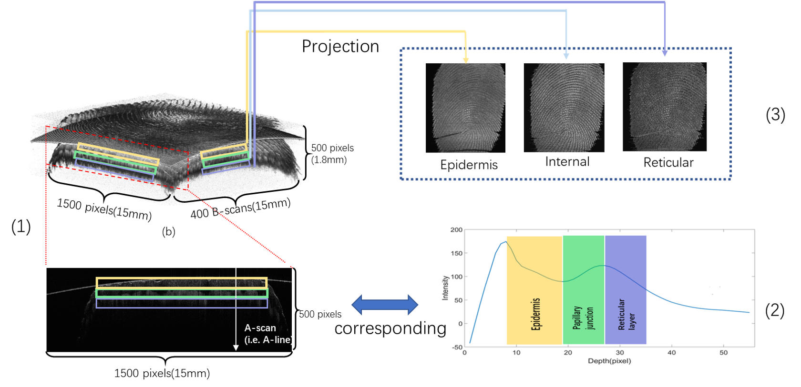

# OCT_fp_reconstruction

## **NEWLY UPDATE ON NOV. 12. 2019**

## Brief introduction
Optical Coherence Tomography (OCT) is a new fingerprint acquisition technology. 
Since 2006, many researches have begun to use OCT technology for fingerprint anti-spoofing and reconstruction.
Compared to traditional 2D fingerprint scanners, OCT technology can additionally collect finger depth information. 
Therefore, reconstruct the fingerprint from the collecting OCT data is one of the main researches at present.

**_Here, this project reports the novelty projection-based fingerprint recontruction method using the contact-based OCT device._**

The OCT acquisition device we used here will collect 400 cross-sectional images for each fingerprint acquisition as shown in the figure below. Each cross-sectional image is composed of multiple Alines. The figure show that each Aline can reflect the information of the subcutaneous structure of the finger skin. More detail of OCT device can click [HERE](https://github.com/CV-SZU/A-Benchmark-Database-using-Optical-Coherence-Tomography-for-Fingerprints).

## Reconstruction algorithm
This project proposes a simple but more efficient projection-based OCT fingerprint reconstruction method.
Our goal is to reconstruct the fingerprint information of the corresponding area according to the physical skin structure.
As can be seen from the figure, for cross-sectional image, according to the trend of the Aline curve, the coordinates of the corresponding physical skin structure area are found, and finally the fingerprint image is reconstructed by the corresponding coordinates of the projection.

**The overall process can be summarized into the following steps**
* Image processing for the cross-sectional image.
* The signal proccessing performs on Aline.
* Physical skin structure area detection. 
* Projection-based reconstruction.

## Notes
**The key codes of the image processing, Aline signal proccessing and reconstruction wiil upload soon.**

## Contributor & Contact information
**Guojie Liu**: 1800271034@email.szu.edu.cn. Attribution: College of Computer Science and Software Engineering, Shenzhen University, Shenzhen 518060, China.

**Feng Liu** : feng.liu@szu.edu.cn. Attribution: College of Computer Science and Software Engineering, Shenzhen University, Shenzhen 
